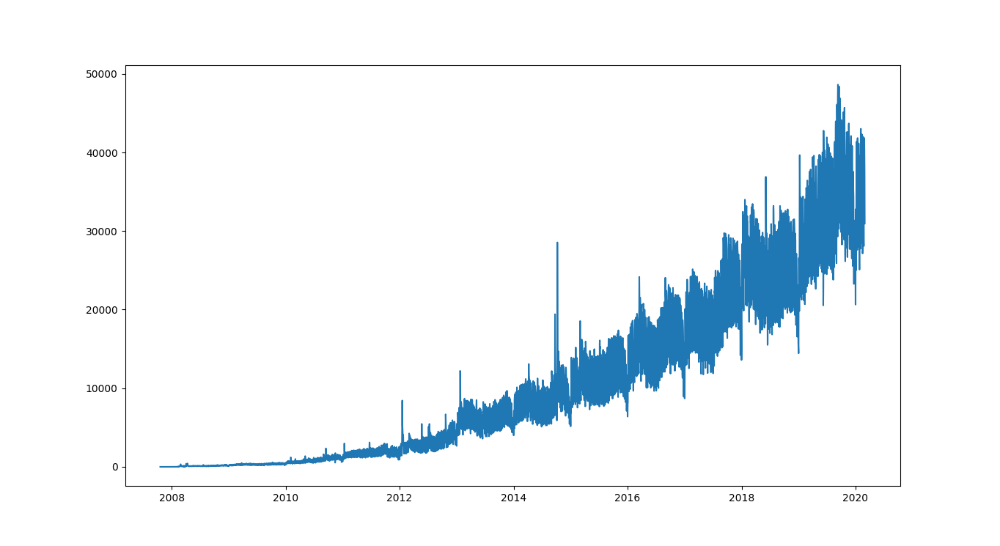
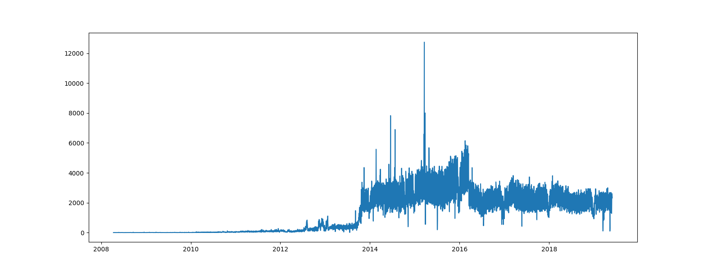
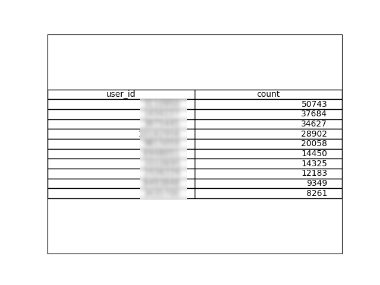

Using GitHub's GraphQL API to get millions of users and analyze their patterns.

<!-- end -->

## Beginnings

So I first noticed that some *personal* user data was available on Github through their REST API. The users endpoint returned user data and you could invidually view each profile -> profiles have websites, bios, emails, full names etc. I had to have it ALL. Plus I thought it was interesting to see how many developers wanted to be found and famed, although I won't be releasing this data to the public. You could scrape it too if you wanted.

## Methods

Wait a minute, what ... you can get that data? Yep, just take a look at `https://api.github.com/users?since=0&per_page=10` to programmatically grab it. This lists all the users and the individual information endpoint is `https://api.github.com/users/{username}`. In fact, you don't even need an API key to access it (you do get rate limited though).

Doing a bit more digging into the GitHub REST API you can only make 5000 requests per hour. Which basically meant 5000 users per hour, give or take, using their endpoints. This wasn't enough. A rough search of the total amount of users in the GitHub search was above 40M. I can't wait years for this. There's gotta be a better way, right?

There is, by using GitHub's GraphQL API. Using their search functionality you can retrieve users registered in increments of 100 users per API call. Awesome. That means 500K users per hour. With the rough total this would take about a week or so (which it did). They also calculate the cost of a GraphQL API call VERY LENIENTLY. Try it out if you have the chance.

Segmenting the users by day and grabbing them based on the time they signed up is the only way to get them all through the GraphQL API. Moreover, I never really sought out to grab a proofed ALL the users for this project. I just wanted a lot. Any day where there were above 24,000 users that signed up I was unable to grasp them all because I was scraping by the hour.

I tried doing this on my poor good boi personal computer but sadly I also wanted to browse the internet and work on other projects. Plus, with only a 256GB SSD I don't have much space to spare. So I spun up a small VM in GCP and ran the script on a crontab every hour. I could've probably optimized by having it sleep instead of on a cron job and check in at the rate-limit-reset-time but I like to approach my projects rough-and-tumble. Where's the fun in spending a few hours writing a mathematically perfect solution when you can have data NOW, start coming up with analysis ideas and fix your code as you go. There's got to be a balance. BRING THE PAIN COME ON

I stored all the data relationally on a Postgres instance in Cloud SQL. I really only needed like 10GB of space so it cost $0 to do the whole project. Plus the $300 in credits from GCP I was just sitting on needed some love.

## GHTorrent and Github Archive

While doing this project I wanted to see some other analyses and found these. They were picking up the event streams from GitHub and posting them publically for analysis. These are AMAZING. Although they are completely deanonymized and made for researchers mostly. Though I did download pieces of both to check it out. I thought GHTorrent looked super promising so I downloaded the 2019 MySQL dump that they had. First off, this was over a 100GB compressed. My bandwidth was crying for 2 days. Second, uncompressed it was 400GB ... So I had to explore the parts I needed piecewise. Honestly, small tip for anyone hosting large data. Just document the schema with some examples of the data in the dataset pls and make it clear where to find the schemas. I realized they had a documentation page after looking through it all and realizing that I didn't even need to bother with like 350GB of the data they had since I didn't find it interesting. Big tip: always read the documentation. GHTorrent is also great since it is two-way compatible with MySQL and PostgreSQL. They have \copy scripts and different schema files (check it out here: https://github.com/gousiosg/github-mirror/tree/master/sql) for both.

## Analysis

* How many days did you scrape? 

I started 2007-10-20, ended on 2018-03-02. As I mentioned before this was a 'lazy' scrape. My deviation on actual users scraped per day vs. the amount of users that signed up was approximately 948 per day. Some days more, some less. It is technically possible to scrape on a granularity of the minute the user was created. You'll probably die of boredom though. This is more than enough sample size for my small research I assume haha.

* How many users scraped?

24,589,201 users total.

* How many listed a ... ?

**location**: 2,924,599.

**email**: 2,167,455.

**name**: 5,602,646.

**website**: 1,421,849.

**bio**: 1,443,553.

**company**: 1,630,421.

So about 5-10% of all users were taking advantage of listing the information that Github allows them to list. Or arguably getting taken advantage of (by me).

* How many listed themselves as hireable?

Only 833,488. A lot less than I imagined. GitHub seems like a solid place to source from.

* Top companies listed

Raw data: https://github.com/nealav/github-scraper/blob/master/data/top_5000_companies.txt

I was unable to actually fuzzy match these companies given a lack of time and compute but I think I did pretty good. (*￣▽￣)ノ

* How many unique companies among users?

983,578. Probably less assuming people have things listed like 'FB', 'Facebook', 'Facebook, Inc.' etc.

* Top locations

    [[boxShadow]]
    | <iframe src="https://storage.googleapis.com/project-datasets/heatmap.html" style="border: 0; width:100%; height:500px;"></iframe>

Zoom out to see the rest. Wrangling the data to show up as a heat map was extremely difficult. So so hard. And also screw gmap. Folium ALL THE WAY. I only used about 2.3 million data points for this heat map. Had to fuzzy match locations and geocode the coordinates and I didn't want to spend a year waiting for all the coordinates to propagate.

Plus you wouldn't believe the crazy stupid inaccurate data in some of the columns where users were clearly just messing around -> https://github.com/nealav/github-scraper/blob/master/data/other/crazy%20locations.gif.

* How many users have their login in their email?

560,033. This means that their login is a substring of their email.

* How many users have their login in their website?

384,305

The above two interest me only because it shows correlation of accounts. If a user is sharing ther login in an email or as a website they are probably using it to identify themselves across multiple websites. Makes hacker hunting a little easier.

* Most used email domains

Raw data: https://github.com/nealav/github-scraper/blob/master/data/top_500_email_domains.txt

* Most used website TLDs

Raw data: https://github.com/nealav/github-scraper/blob/master/data/top_500_tlds.txt

* http vs https in website

HTTPS - 460,909.
HTTP - 552,077.

* How many use ... as their website?

Twitter: 28,052

LinkedIn: 108,291

Facebook: 15,617

* Top words in user bios

Raw data: https://github.com/nealav/github-scraper/blob/master/data/top_5000_bio_words.txt

## GHTorrent Data

I analyzed a few pieces of this as well: users, commit_comments, project_members, projects, pull_request_comments. The GHTorrent dump ends on 2019-06-01.

* How many users?

32,411,734 in total.

* How many sign up per day?

* Top locations (country)

    [[boxShadow]]
    | <iframe src="https://storage.googleapis.com/project-datasets/heatmap_ghtorrent.html" style="border: 0; width:100%; height:500px;"></iframe>

This is specifically the GHTorrent data. Thank god that it already had the geocoded lat/long. I used a similar ~2M accounts for analysis.

* Top companies listed

Raw data: https://github.com/nealav/github-scraper/blob/master/data/top_5000_companies_ghtorrent.txt

This is interesting because it seems like there were a lot of bot accounts trying to spam links with the company field. Seems like GitHub purged them.

* How many pull request comments?

35,453,290

* How many projects?

125,486,232. This includes forks. I wasn't going anywhere near analyzing this. My computer would've had a breakdown. Not to worry since there wasn't really much interesting in the table anyways.

* Top languages in projects

Top Order: [['JavaScript', 13402663], ['Java', 8761966], ['Python', 7306617], ['HTML', 4750381], ['Ruby', 3945828], ['PHP', 3442813], ['C++', 2986247], ['CSS', 2640028], ['C', 2372246], ['C#', 2215896], ['Shell', 1798348], ['Go', 1345421]]

Raw data: https://github.com/nealav/github-scraper/blob/master/data/top_100_projects_by_language.txt

* How many project members?

12,618,714. This represents the number of members across all projects.

* How many commit comments?

5,682,741

* How many commit comments per day?

* Most said words in commit comments

* Oh and by the way, this is what the data looks like uncleaned. Dirty mhm.

* Top users submitting commit comments

I blurred this one out in case anyone gets on my back. Although I take bribes if you want to top the leaderboards. This **** don't pay.

## Conclusion

The potential use cases for this that I see:
* Talent Sourcing - you can source talent from any company, any location, by amount of repos, amount of followers etc. Especially useful for developers that put themselves as hireable or that work at larger tech companies. You can even source talent for consultation by looking for startup founders, active python devs etc.
* Personalized Bug Bounties - find bugs on people's projects or personal websites (do not attack them) and pop them an automated email from your screener or a message on GitHub or make an issue on their repo to warn them.
* Research applications - look at weird hotspots of developers based on their location, detect fake accounts on Github, get the scoop from niche developer communities in the boonies

Honestly the potential is endless. I'll probably be doing more analysis when I can. The geographical developer/user data really is priceless.

## Postmortem, Fun Points, References

See my code here: https://github.com/nealav/github-email-scraper (be gentle uwu).

[0] https://github.com/nealav/github-scraper/tree/master/data. There are some examples of my data here and some of it even has the full data. The coordinates are a full set with their frequency and can also be found in the heatmap code. The frequencies of all the word clouds are also here. I have some example endpoints screenshotted as well here: https://github.com/nealav/github-scraper/tree/master/data/other. Feel free to take a spin at your own word clouds or plotting your own heat maps. HAHA

[1] Why df isn't my Node running through crontab? OH, because cron passes in a completetely different environment without Node in the path

[2] So you think you're bulletproof, huh? You didn't post your email so I can't get it, right? Well, here's another thing that surprised me. Looking into the GitHub events stream, most commits have an author email attached to them. So, sorry to say but, if you haven't listed your email on your profile a person can still scrape it from their Events API (part 2 maybe? lol). Seriously, just check out `https://api.github.com/users/{username}/events/public`

[3] Tried to do the whole thing in Node but I eventually realized that the data analysis packages of Node SUCK. SUCK HUGE BIG. Immediately switched to Python and KNOCKED IT OUT.

[4] I NEED A FASTER COMPUTER WHY ARE THESE QUERIES SO SLOW - I've been slowly going insane and upping my Cloud SQL instance memory/SSD storage and vCPUs. At first it was 1 vCPU with 0.6GB memory and 10GB SSD, then 1 with 2GB memory and 40GB SSD, then finally 2 with 8GB memory and 46GB SSD.

[5] https://alcidanalytics.com/p/geographic-heatmap-in-python
