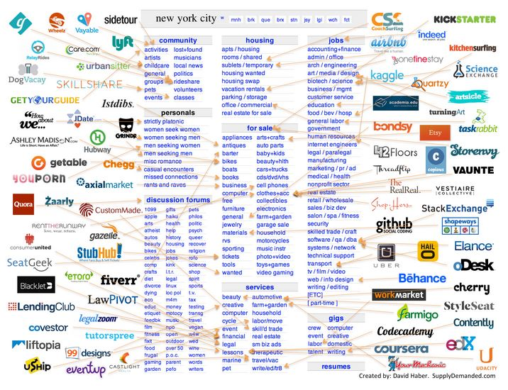

The rise of 'micro-'.

<!-- end -->

## 'micro-' what?

The Prefix 'micro-' is coming into it's own in the field of software engineering. Microservices, micro-kubenetes (Minikube), micro-tools, micro-VMs etc. Formally none of these exist but we are trending towards smaller bundles, bite-sized applications and deployments, and even trying to minify our runtime with tools like Docker. Small/micro- may not be the right term for this. But as the amount of tools and environments we need to use and support has grown, the more urgent a need has shown up to isolate and segment our thought process as software engineers into more managable and composable pieces.

## Exploring 'micro-' to generate startup ideas

After seeing this chart about startups mapped to Craigslist sections I had the idea of exploring what kind of startups could be made just by attaching 'micro-' to already existing products, tools, ideas and companies. Some of my inspiration for applying it to startup ideas comes from this [2020 Startup Themes List](https://dcgross.com/2020-startup-themes/?src=t).

* **micro-Deployments**: sounds promising. Using minified containers/images to run your build or deployments.
* **micro-Advertising**
* **micro-Code**: Tools or GUI based programming to reduce the amount of code that you have to write/generate?
* **micro-Search**: 'Human' or rank curated search engine results minifier. Removes sites that are deemed spammy, have inaccurate information, biased etc.
* **micro-Images**
* **micro-Cloud**
* **micro-Drive**: Auto-zips your files when uploading to Cloud Storage Drive to maximize space.
* **micro-Fitness**
* **micro-Collaboration**: Small meetings/reminders.
* **micro-Terminal**: Carry a containerized version of your tools/terminal on a USB that you can run as plug-and-play stand alone application.
* **micro-Voice-Recognition**: Recognizes with high fidelity a small subset of terms and words. Quality over quantity.
* **micro-Visualizations**
* **micro-Consultancy**: A promising idea for smaller bite-sized consultancy aimed at the public and specific teams in companies. Depends entirely on the quality of consultants or the scheduling system for attracting high quality career-men and women.
* **micro-Health**
* **micro-Feedback**: Get specific feedback on something from a demographic of users. 1 question surveys?
* **micro-Scaler**
* **micro-Branding**
* **micro-Website**: One page websites. (Not SPA, no re-rendering)
* **micro-Events**: Create on the spot events in a radius around you.
* **micro-AirBnB**: Stays for < 1 day.
* **micro-Politics**
* **micro-Dating**
* **micro-Pets**: Borrow or foster pets for a day.
* **micro-Learning**
* **micro-Law**
* **micro-Restaurant**: Limited items and/or small/cheap portions.
* **micro-Investing**
* **micro-Systems-Administration**: Adminster your systems by issuing commands centrally.
* **micro-Donation**: Donate in increments < $1.
* **micro-Journaling**: Journal snippets.
* **micro-Farming**
* **micro-Video-Editing**: Edit small videos with a suite of tools.
* **micro-Online-Retail**: Registered shops only sell limited inventory.
* **micro-Rideshare**
* **micro-Delivery**: Delivery in a radius around carriers.
* **micro-Library**: Check out books for limited periods of time to dip your toes into whether they have the information you're looking for.
* **micro-Therapy**: On the spot 10-15 minute therapy sessions.
* **micro-Cleaning**: Maid-service for single rooms.
* **micro-Fundraising**: Only raise funds in small increments.
* **micro-Testing**: Write small test suites for applications.
* **micro-Identification**: Identify specific objects/places rather than images.
* **micro-Transactions**
* **micro-Wifi**: Small-scale Wifi hotspots in cities.

I see some interesting ideas sprouting but nothing too solid. Play along by looking at [this job list](https://unawaz.github.io/stochastic-hill-climbing/tasks/) and seeing if 'micro-' fits the mold.

